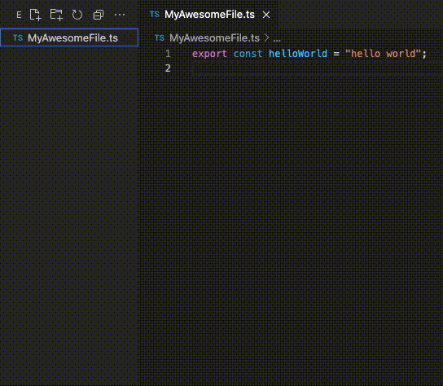

# Jfolderize README

A VSCode Extension the will turn your `File.extension` into `File/index.extension`;

## Demo

## Known Issues

## Release Notes

Users appreciate release notes as you update your extension.

### 0.0.1

Prototype release

---

## How To use

Select one of your file in file explorer, `Right-Click`, click the `JFolderize` button on the menu. and you are done.
